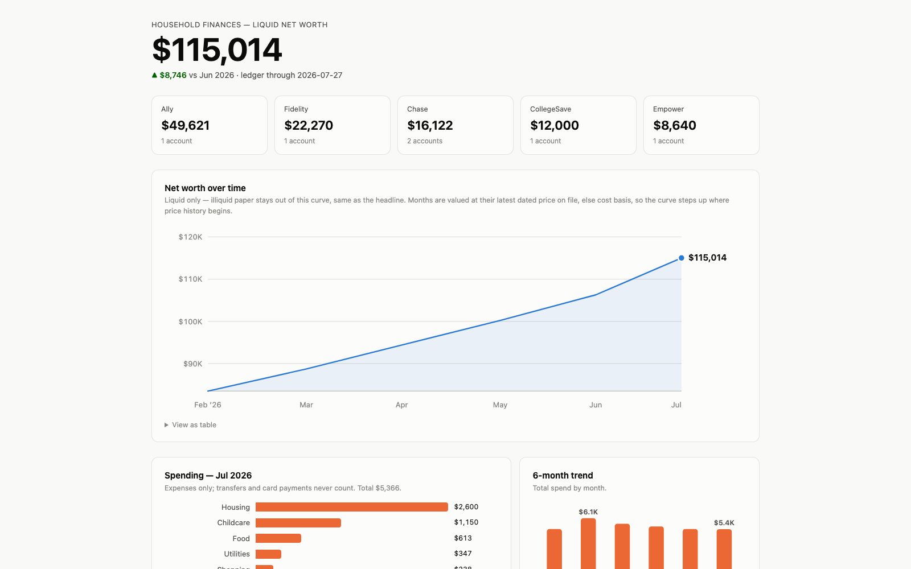

# Call Sara ☎️

**The family accountant, except she lives in your terminal and already
read your statements.**

I wanted a financial advisor that actually knows my numbers. Not a
chatbot with amnesia. Not another SaaS asking for my bank password. So
I built Sara: a Claude skill with a plain-text vault of your household's
entire financial life on your own disk, and a personality that opens
with the number and never scolds.

Here she is, mid-checkup (demo data):

```
> how are we doing

Liquid net worth $115,014 as of Aug 1 — July added $6,046 ($11,412
in, $5,366 out). Cash is fine: $49,621 in the Ally HYSA against
your ~$40K six-month floor. One thing while I was in there: you're
paying for Netflix, Hulu, AND Max — three overlapping streamers,
$50/mo. Keep one, drop two, that's ~$420/yr back. Want the cancel
pages?
```

Decision support, not a licensed advisor. Details at the bottom.

## What she does

- 🧠 **Remembers everything.** Every transaction, every account, and an
  investment thesis you agreed to in writing. Big decisions get decided
  once, not re-litigated every chat.
- 💸 **Hunts for money.** Waste, bad rates, unclaimed property, expiring
  card credits. Findings come with dollars per year and the exact fix.
  (Setting this up on my own house surfaced a six-figure account nobody
  was tracking. True story!)
- 🏦 **Pulls your statements.** She drives your logged-in bank sites and
  imports with dedupe and balance reconciliation. You type passwords,
  you click anything that moves money. Always.
- 📊 **Shows you the picture.** A local-only dashboard: net worth curve,
  drill-downs, a 60-day cash-flow forecast.
- 🧾 **Does the boring parts right.** Monthly reviews (the household
  calls it the cheshbon), instant queries, a shareable assessment.



## Get started

Three steps, about five minutes (onboarding itself is ~90, she's thorough):

1. **Fork this repo**, then:
   ```bash
   git clone <your-fork> ~/code/call-sara
   cd ~/code/call-sara && ./install.sh
   ```
   install.sh does everything: links the skill, arms the secret scanner,
   grabs its own dependencies.
2. **Open a NEW Claude Code session** (skills load at startup).
3. Say **"set up my finances."** Sara takes it from there.

Just want to poke around first? Totally fair:
```bash
skills/finance/scripts/init_vault.sh --demo /tmp/demo-vault
skills/finance/scripts/dashboard.sh --vault /tmp/demo-vault
```
Something broken? `skills/finance/scripts/doctor.sh` will tell you what.

**Requirements:** macOS, Python 3.11+ (install.sh handles it), and
optionally the Claude in Chrome extension for statement fetching. Note
that driving a logged-in bank session may conflict with your bank's
terms of use. Your call, your account.

## Where your data goes

Short version: **your disk, your private git remote, nowhere else** —
with exactly six honest exceptions:

1. Vault contents Sara reads enter Claude's model context, like anything
   you'd paste into a chat.
2. Pushes go to your private remote (if you set one up).
3. Published assessments are private-by-default claude.ai pages.
4. With the Chrome extension, Claude reads bank pages you're logged into.
5. Price refreshes send ticker symbols (never balances) to quote APIs.
6. Savings research sends merchant terms (never identities) to web search.

Account numbers are last-4 only, sensitive documents never enter git,
and a fail-closed gitleaks scanner blocks commits that break the rules.
Sara never needs a password, SSN, or full account number typed into
chat. If any of this is out of bounds for you, don't use this.

## Who it's for

You like terminals, you want your financial life local-first and
inspectable, and you'd rather own a plain-text ledger than hand your
bank login to a startup. If that's you, welcome!

## How it works

One rule runs the whole system: **Sara handles the fuzzy parts, code
owns every number.** The money lives in a
[Beancount](https://beancount.github.io/docs/) ledger (plain-text,
double-entry, re-validated on every change) that you never hand-edit;
importers write it, tests keep it honest. Why so strict? One HN author
measured the same 457-row calculation: CLI, 8 seconds. Raw LLM
arithmetic, 3+ minutes and 67,709 tokens, still needing weekly
re-verification. "It was right the last three times" is not a
foundation for your books.

**The map:**

| Path | What's in it |
|---|---|
| `skills/finance/SKILL.md` | The entry point. Read exactly what the model is told. |
| `skills/finance/references/` | The method: onboarding, playbook, current-year figures, site notes. |
| `skills/finance/tools/` | The deterministic layer: importers, queries, checks, forecast. |
| `skills/finance/vault-template/` | Vault skeleton (+ a demo variant). |
| `skills/finance/scripts/` | init, doctor, prices, dashboard, filing. |

## Make it yours

Fork-first by design. It's markdown and small Python: rename Sara, teach
her your bank's quirks, retune the playbook to your country, add
importers. PRs for anything generally useful are very welcome! The test
suite keeps the money math honest while you hack.

## The fine print

Educational decision support, not legal, tax, or investment advice; no
CPA, CFP, or fiduciary duty behind it. For filings, estate documents,
and big irreversible moves, see a licensed professional. Sara will tell
you when.

MIT licensed. Go build.
